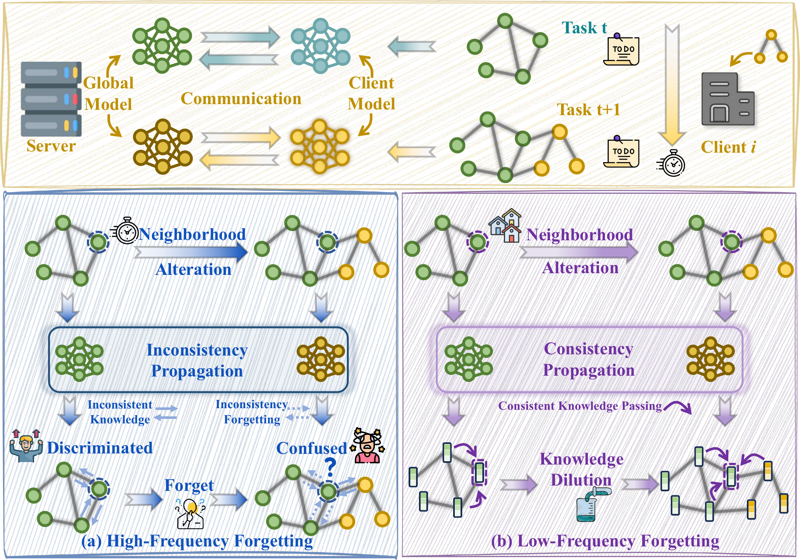

# FedFST: Mitigating Spectral Catastrophic Forgetting in Federated Graph Continual Learning

FedFST is a spectral-aware framework for Federated Graph Continual Learning (FGCL). It targets catastrophic forgetting in privacy-preserving graph neural network training over distributed graph data with dynamic task streams.

From a spectral perspective, FGCL forgetting contains two coupled problems:

- **High-frequency inconsistency forgetting**: newly emerging neighborhood inconsistency disrupts message passing and weakens discriminative historical knowledge.
- **Low-frequency consistency forgetting**: over-adaptation to new tasks dilutes stable global semantic consistency.

FedFST mitigates these problems with:

- **HHKR**: Historical High-Frequency Knowledge Restoration.
- **HLST**: Historical Low-Frequency Semantic Transfer.

## Motivation

The motivation figure is directly extracted from the paper motivation PDF.



## Repository Structure

```text
.
|-- args.py
|-- main.py
|-- utils.py
|-- algorithm/
|   |-- Base.py
|   `-- Ours.py
|-- datasets/
|   |-- dataset_loader.py
|   `-- partition.py
`-- models/
    |-- GAT.py
    |-- GCN.py
    `-- model.py
```

## Environment Setup

Python 3.9-3.11 is recommended.

Create and activate a conda environment:

```powershell
conda create -n fedfst python=3.10 -y
conda activate fedfst
python -m pip install --upgrade pip
```

Install PyTorch. Choose the command that matches your machine:

```powershell
# CPU
python -m pip install torch --index-url https://download.pytorch.org/whl/cpu

# CUDA 12.1
python -m pip install torch --index-url https://download.pytorch.org/whl/cu121
```

Install PyTorch Geometric and its compiled extensions after PyTorch is installed:

```powershell
python -m pip install torch-geometric
$TORCH_VER = python -c "import torch; print(torch.__version__.split('+')[0])"
$CUDA_TAG = python -c "import torch; print('cpu' if torch.version.cuda is None else 'cu' + torch.version.cuda.replace('.', ''))"
python -m pip install pyg_lib torch_scatter torch_sparse torch_cluster torch_spline_conv -f "https://data.pyg.org/whl/torch-$TORCH_VER+$CUDA_TAG.html"
```

Install the remaining dependencies:

```powershell
python -m pip install numpy scipy pandas scikit-learn networkx python-louvain ogb gdown matplotlib tqdm
```

## Datasets

Supported `--dataset_name` values:

```text
cora, citeseer, pubmed, ogbn-arxiv, computers, physics, roman_empire, year, actor, cs
```

By default, datasets are stored under:

```text
datasets/raw_data
```

Use `--dataset_dir <path>` to specify another dataset directory.

## Run

Enter the repository root:

```powershell
cd D:\CODING\VScode_coding\Research\FedFST\FedFST
```

The current `main.py` prints `kd_ce_weight`, `gen_ce_weight`, and `S_high_D_weight` before training. If these fields are not defined in your local `args.py`, use this no-code-change launcher:

```powershell
python -c "import args as a; a.parser.add_argument('--kd_ce_weight', type=float, default=0.5); a.parser.add_argument('--gen_ce_weight', type=float, default=1.0); a.parser.add_argument('--S_high_D_weight', type=float, default=0.5); import main; main.main()" `
  --dataset_name cora `
  --model GAT `
  --clients_num 3 `
  --rounds 10 `
  --local_epochs 3 `
  --gen_rounds 2 `
  --gen_epochs 200 `
  --kd_epochs 200 `
  --kd_lr 0.002 `
  --gen_lr 0.005 `
  --lr 0.005 `
  --per_task_class_num 2 `
  --device_id 0 `
  --save_dir .\outputs\cora_gat_seed24
```

For a quick smoke test:

```powershell
python -c "import args as a; a.parser.add_argument('--kd_ce_weight', type=float, default=0.5); a.parser.add_argument('--gen_ce_weight', type=float, default=1.0); a.parser.add_argument('--S_high_D_weight', type=float, default=0.5); import main; main.main()" `
  --dataset_name cora `
  --model GCN `
  --clients_num 2 `
  --rounds 1 `
  --local_epochs 1 `
  --gen_rounds 1 `
  --gen_epochs 1 `
  --kd_epochs 1 `
  --num_samples_per_class 5 `
  --device_id 0 `
  --save_dir .\outputs\smoke
```

If `args.py` already defines the three compatibility fields, run the direct entry point:

```powershell
python main.py --dataset_name cora --model GAT --clients_num 3 --rounds 10 --device_id 0 --save_dir .\outputs\cora_gat_seed24
```

## Important Arguments

```text
--dataset_name           Dataset name.
--dataset_dir            Dataset root directory.
--model                  GNN backbone: GAT or GCN.
--clients_num            Number of federated clients.
--rounds                 Federated aggregation rounds per task.
--local_epochs           Local client training epochs per round.
--gen_rounds             Generator communication rounds.
--gen_epochs             Local feature generator epochs.
--kd_epochs              Server-side knowledge distillation epochs.
--kd_khop                K-hop smoothing depth for low-frequency distillation.
--per_task_class_num     Number of classes introduced per continual task.
--S_high_x_weight        Feature-side high-frequency score weight.
--S_high_A_weight        Structure-side high-frequency score weight.
--num_samples_per_class  Synthetic samples per historical class.
--device_id              CUDA device index when GPU is available.
--save_dir               Directory for generated loss plots.
```

## Outputs

Training prints task-wise global accuracy, the final accuracy matrix, AA, and AF. Loss curves are saved under `--save_dir`.

## Citation

FedFST: Mitigating Spectral Catastrophic Forgetting in Federated Graph Continual Learning. SIGKDD 2026. Hanyao Guo, Zihan Tan, Wenke Huang, Bin Yang, and Mang Ye.
